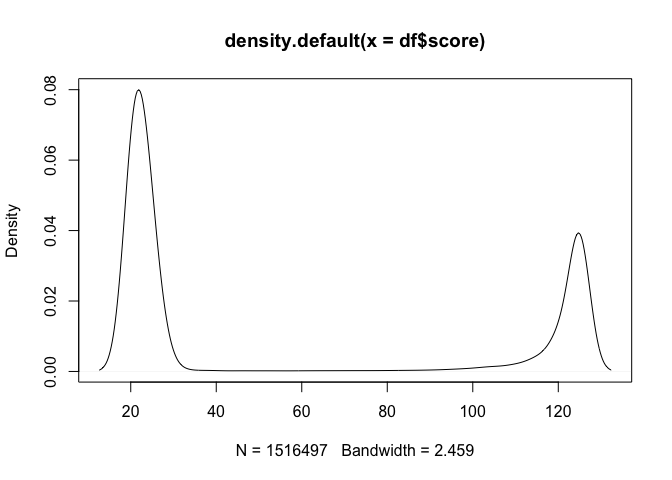
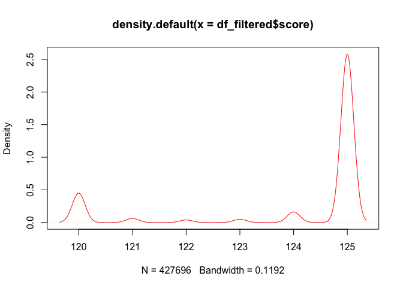
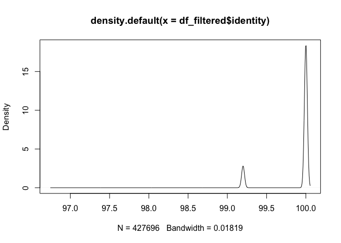
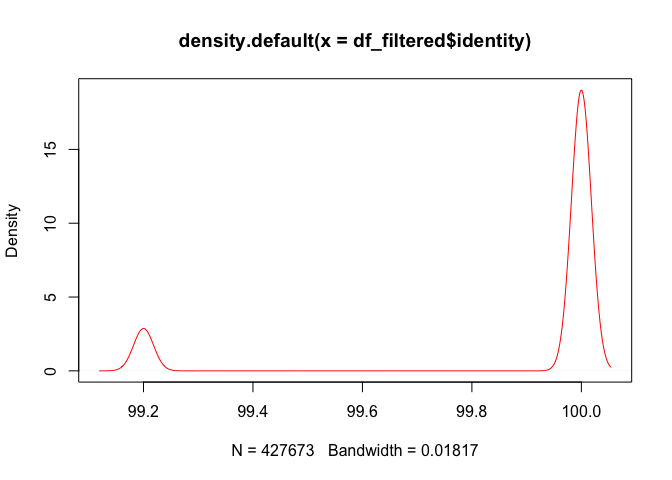

# SimpleGeneExpression
Programs to quantify expression of transcripts from public datasets

This tutorial is based on the analysis of the Magic-BLAST table output. Please, read the 
[documentation](https://ncbi.github.io/magicblast/) to understand how Magic-BLAST 
works.   

The first three rows of the typical magic-BLAST output file contains some info 
related to the software version, the command line used and the fields description: 
  
  
  
<br>
We may want to remove those rows with the command line :   

```{}
tail -n +4 my_magic > my_magic
```

Here, the starting point is a dataset made of 24 auxin receptor factors (ARF) genes from the chickpea genome. Code to identify those accessions is available from the [GeneHummus](https://github.com/NCBI-Hackathons/GeneHummus) repository. We will study the frecuency of the 24 ARF genes in root tissues of two genotypes under drought stress and control conditions across 4 SRA libraries:   

* [SRR5927129](https://www.ncbi.nlm.nih.gov/sra/?term=SRR5927129). Susceptible_Control  
* [SRR5927130](https://www.ncbi.nlm.nih.gov/sra/?term=SRR5927130). Susceptible_Drought  
* [SRR5927133](https://www.ncbi.nlm.nih.gov/sra/?term=SRR5927133). Tolerant_Control  
* [SRR5927134](https://www.ncbi.nlm.nih.gov/sra/?term=SRR5927134). Tolerant_Drought  

First, load the functions needed for the analysis. 
```r
source("functions/expression.R")
```

Then, we load the `my.table.rda` object. This table is the magic-BLAST output file, which has been cut to show the first 500,000 lines of the original output for illustrative purposes. After loading the object into the environment, the `df` 
dataset is available.   

```r
load("data/my.table.rda")
```

Having cleaned the first three lines from the magic-BLAST output (as said above), 
next we want to name the columns 


```r
names(df) <- c("query.acc", "reference.acc", "identity", "not.used", "not.used.1",
              "not.used.2", "query.start", "query.end", "reference.start", 
              "reference.end", "not.used.3", "not.used.4", "score", "query.strand",
              "reference.strand", "query.length", "BTOP", "num.placements", 
              "not.used.5", "compartment", "left.overhang", "right.overhang", 
              "mate.reference", "mate.ref..start", "composite.score")    
```

Check the dataset dimensions.

```r
dim(df)
```

```
## [1] 1516497      25
```

Before analyzing the data, we have to apply a number of filters to tidy the dataset. 

## Filter
### Filter 1 : alignement length score 
If we check the query lengths (length reads) we can see that the whole dataset is made of reads 125 bp length.

```r
table(df$query.length)
```

```
## 
##     125 
## 1516497
```

**Filter1** involves filtering by high alignement length score. We can check the length scores: 

```r
plot(density(df$score))
```

<!-- -->


Here, we want to use at least 120 bp as an argument for the function `by_score`. 


```r
df_filtered <- by_score(df, 120) 
plot(density(df_filtered$score), col = "red")
```

<!-- -->


### Filter 2 : identity 
We want high scores for the alignements but also with high identities. See the distribution of the identities for the filteres data : 

```r
plot(density(df_filtered$identity))
```

<!-- -->

**Filter2** involves filtering by high identities. Here we use at least 99% as 
an argument for the function `by_identity`

```r
df_filtered <- by_identity(df_filtered, 99)
plot(density(df_filtered$identity), col = "red")
```

<!-- -->

The function `tidy_query.acc`creates a new dataset with the number of sequence 
counts from the filtered data.  

```r
df_filtered <- tidy_query.acc(df_filtered)
# Create a tibble object
df_filtered <- as_data_frame(df_filtered)
```


### Plot of Counts

```r
hist(df_filtered$Count)
```

<!-- -->

### Plot Counts ~ SRA run

```r
boxplot(df_filtered$Count ~ df_filtered$Query, 
        outline = FALSE, 
        main = "Sequence Counts per run", 
        col = c("grey80", "grey50", "grey80", "grey50"))
```

<!-- -->
  
  
### Optional filter:   
Genes with presence at least in *n* SRA libraries    


```r
df_filtered %>% 
  group_by(Reference) %>% 
  summarize(Total = n()) %>%
  arrange(Total)
```

```
## # A tibble: 24 x 2
##    Reference    Total
##    <fct>        <int>
##  1 LOC101514738     1
##  2 LOC101489666     4
##  3 LOC101491204     4
##  4 LOC101492112     4
##  5 LOC101492136     4
##  6 LOC101492451     4
##  7 LOC101492916     4
##  8 LOC101493974     4
##  9 LOC101496441     4
## 10 LOC101498188     4
## # ... with 14 more rows
```
Filter by genes present in all 4 libraries. 


```r
# total number of occurrences for each gene
mydf <- df_filtered %>% 
  filter(Reference != "LOC101514738" )

mydf
```

```
## # A tibble: 92 x 3
##    Query      Reference    Count
##    <chr>      <fct>        <int>
##  1 SRR5927129 LOC101489666  3671
##  2 SRR5927129 LOC101491204 10345
##  3 SRR5927129 LOC101492112  3407
##  4 SRR5927129 LOC101492136  2189
##  5 SRR5927129 LOC101492451   249
##  6 SRR5927129 LOC101492916   514
##  7 SRR5927129 LOC101493974   823
##  8 SRR5927129 LOC101496441   686
##  9 SRR5927129 LOC101498188 10933
## 10 SRR5927129 LOC101498659  3634
## # ... with 82 more rows
```

Now, add a column with the SRA run size with the `gatherSize` function 


```r
mydf <- mutate(mydf, Runsize = gatherSize(mydf))
```

Look at head and tail of `mydf`


```r
mydf %>% head()
```

```
## # A tibble: 6 x 4
##   Query      Reference    Count Runsize
##   <chr>      <fct>        <int>   <dbl>
## 1 SRR5927129 LOC101489666  3671   9964.
## 2 SRR5927129 LOC101491204 10345   9964.
## 3 SRR5927129 LOC101492112  3407   9964.
## 4 SRR5927129 LOC101492136  2189   9964.
## 5 SRR5927129 LOC101492451   249   9964.
## 6 SRR5927129 LOC101492916   514   9964.
```


```r
mydf %>% tail()
```

```
## # A tibble: 6 x 4
##   Query      Reference    Count Runsize
##   <chr>      <fct>        <int>   <dbl>
## 1 SRR5927134 LOC101505543   621   8987.
## 2 SRR5927134 LOC101509304   443   8987.
## 3 SRR5927134 LOC101509547    52   8987.
## 4 SRR5927134 LOC101513952  1654   8987.
## 5 SRR5927134 LOC101514889   428   8987.
## 6 SRR5927134 LOC101515039  2819   8987.
```

### Normalized counts


```r
mydf_norm <- mydf %>% 
  mutate(norm_Counts = Count*mean(Runsize)/Runsize) %>%
  select(Query, Reference, norm_Counts)

mydf_norm
```

```
## # A tibble: 92 x 3
##    Query      Reference    norm_Counts
##    <chr>      <fct>              <dbl>
##  1 SRR5927129 LOC101489666       3497.
##  2 SRR5927129 LOC101491204       9854.
##  3 SRR5927129 LOC101492112       3245.
##  4 SRR5927129 LOC101492136       2085.
##  5 SRR5927129 LOC101492451        237.
##  6 SRR5927129 LOC101492916        490.
##  7 SRR5927129 LOC101493974        784.
##  8 SRR5927129 LOC101496441        653.
##  9 SRR5927129 LOC101498188      10414.
## 10 SRR5927129 LOC101498659       3461.
## # ... with 82 more rows
```


